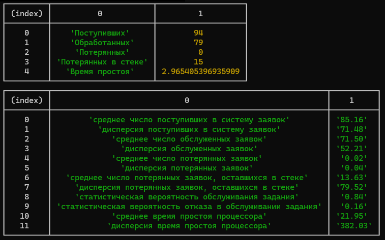

## About The Project

This project contains simulation model of a computing system based on an event-driven simulation method.



**Output data:**
1. the number of received tasks;
2. the number of processed tasks;
3. the number of tasks lost due to overflow of the computing system's STACK;
4. the number of tasks remaining in the STACK after the end of the simulation time T;
5. the probability of processing tasks,
6. the probability of denial of service;
7. the processor's idle time

_The simplest computing system contains a processor and a memory device (STACK) consisting of **m** cells. Each cell can store one task waiting to be serviced. Thus, a queue of **m** tasks can be formed in front of the processor._

_When executed, the task takes up all the processor time. If the processor is busy when the next task arrives, but there are free memory cells, then the task is queued for execution. If all memory cells are occupied, then the task cannot be serviced and is lost._

_If at the end of the simulation time the computing system is still executing the task, then the actual simulation time increases by the value **Δτ**, which is necessary for the complete servicing of the task: Tf = T + Δτ._

_The intervals of arrival and execution of the task are random variables with an exponential distribution law with the parameter **λ** for the intervals of arrival and **μ** for the intervals of execution._

More about the algorithm [in the docs](./docs/) (_Russian_).


### Built With

* [Node.js](https://nodejs.org/en)
* [prompt-sync](https://www.npmjs.com/package/prompt-sync)

<p align="right">(<a href="#readme-top">back to top</a>)</p>


<!-- GETTING STARTED -->
## Getting Started

This is an example of how you may give instructions on setting up your project locally.
To get a local copy up and running follow these simple example steps.

### Prerequisites

* [Node.js](https://nodejs.org/en) installed

### Installation

1. Clone the repo
   ```sh
   git clone https://github.com/biggytech/event-driven-simulation-system
   ```
2. Install NPM packages
   ```sh
   npm install
   ```
3. Run the simulation
   ```sh
   npm run start
   ```

## Languages Support

- [x] Russian
